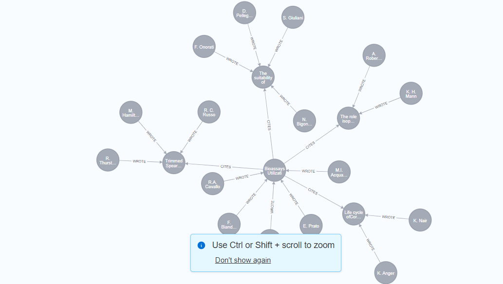

### 1 What are the most influential papers in the dataset?

To check the 100 most influential papers in the dataset, we can use the number of citations a paper has. We used the below query to check the number of citations:

```cypher
MATCH (p:Paper)<-[:CITES]-(p2:Paper)
RETURN p.title, count(p2) as citations
ORDER BY citations DESC LIMIT 100;
```

However, this query groups the papers by their title. If two papers have the same title, they will be grouped together. Due to this, the papers  with title "Introduction were grouped and the sum of their citations was returned
To avoid this, we can use the DOI of the paper to check the number of citations. The DOI is unique for each paper and will not be grouped with other papers. We used the below query to check the number of citations:

```cypher
MATCH (p:Paper)<-[:CITES]-(p2:Paper)
RETURN p.doi, p.title, count(p2) as citations
ORDER BY citations DESC LIMIT 100;
```

```
╒═════════════════════════════════════════╤══════════════════════════════════════════════════════════════════════╤═════════╕
│p.doi                                    │p.title                                                               │citations│
╞═════════════════════════════════════════╪══════════════════════════════════════════════════════════════════════╪═════════╡
│"10.1177/0002716293530001006"            │"The New Second Generation: Segmented Assimilation and its Variants"  │520      │
├─────────────────────────────────────────┼──────────────────────────────────────────────────────────────────────┼─────────┤
│"10.1111/J.1464-0597.1997.TB01087.X"     │"Immigration, Acculturation, and Adaptation"                          │402      │
├─────────────────────────────────────────┼──────────────────────────────────────────────────────────────────────┼─────────┤
│"10.2307/3655005"                        │"Legacies: The Story of the Immigrant Second Generation"              │375      │
├─────────────────────────────────────────┼──────────────────────────────────────────────────────────────────────┼─────────┤
│"10.1016/0191-6599(95)90485-9"           │"Imagined communities: Reflections on the origin and spread of nationa│348      │
│                                         │lism"                                                                 │         │
├─────────────────────────────────────────┼──────────────────────────────────────────────────────────────────────┼─────────┤
│"10.2307/2547133"                        │"Citizenship and Nationhood in France and Germany"                    │335      │
├─────────────────────────────────────────┼──────────────────────────────────────────────────────────────────────┼─────────┤
│"10.5860/choice.41-3746"                 │"Remaking the American Mainstream: Assimilation and Contemporary Immig│329      │
│                                         │ration"                                                               │         │
├─────────────────────────────────────────┼──────────────────────────────────────────────────────────────────────┼─────────┤
```


### 3 Who are the top authors based on the number of papers they have published?

```cypher
MATCH (a :Author)
MATCH (a)-[:WROTE]-(p :Paper)
WITH a, count(p) as number_of_papers_published
RETURN a.author_name, number_of_papers_published
ORDER BY number_of_papers_published DESC;
```

```
╒═══════════════════════════╤══════════════════════════╕
│a.author_name              │number_of_papers_published│
╞═══════════════════════════╪══════════════════════════╡
│"M. Verkuyten"             │197                       │
├───────────────────────────┼──────────────────────────┤
│"D. Massey"                │197                       │
├───────────────────────────┼──────────────────────────┤
│"D. Williams"              │130                       │
├───────────────────────────┼──────────────────────────┤
│"S. Schwartz"              │121                       │
├───────────────────────────┼──────────────────────────┤
│"M. Banton"                │120                       │
├───────────────────────────┼──────────────────────────┤
│"Brenda S. A. Yeoh"        │113                       │
├───────────────────────────┼──────────────────────────┤
│"M. Hewstone"              │111                       │
├───────────────────────────┼──────────────────────────┤
```

### 5 What are the most cited papers in the dataset?

```cypher
MATCH (p :Paper)
OPTIONAL MATCH (x :Paper)-[:CITES]-(p)
WITH p, count(x) as citations
RETURN p.title, citations
ORDER BY citations DESC;
```

```
╒══════════════════════════════════════════════════════════════════════╤═════════╕
│p.title                                                               │citations│
╞══════════════════════════════════════════════════════════════════════╪═════════╡
│"Changing World Religion Map: Status, Literature and Challenges"      │834      │
├──────────────────────────────────────────────────────────────────────┼─────────┤
│"National Identities and International Relations"                     │532      │
├──────────────────────────────────────────────────────────────────────┼─────────┤
│"The New Second Generation: Segmented Assimilation and its Variants"  │520      │
├──────────────────────────────────────────────────────────────────────┼─────────┤
│"Southern Gaul and the Mediterranean: Multilingualism and Multiple Ide│425      │
│ntities in the Iron Age and Roman Periods"                            │         │
├──────────────────────────────────────────────────────────────────────┼─────────┤
│"Conceptualizing Simultaneity: A Transnational Social Field Perspectiv│423      │
│e on Society 1"                                                       │         │
├──────────────────────────────────────────────────────────────────────┼─────────┤
│"Immigration, Acculturation, and Adaptation"                          │402      │
├──────────────────────────────────────────────────────────────────────┼─────────┤
│"Legacies: The Story of the Immigrant Second Generation"              │375      │
├──────────────────────────────────────────────────────────────────────┼─────────┤
```
### 7 Do we have disconnected communities in the network? If yes, what are they?

```cypher
CALL gds.graph.project('research-network', ['Author', 'Paper'], ['WROTE', 'CITES'])
```

```cypher
CALL gds.wcc.write('research-network', {writeProperty:'researchWcc'})
 YIELD componentCount, componentDistribution

╒══════════════╤══════════════════════════════════════════════════════════════════════╕
│componentCount│componentDistribution                                                 │
╞══════════════╪══════════════════════════════════════════════════════════════════════╡
│2541          │{min: 1, p5: 1, max: 724199, p999: 39, p99: 10, p1: 1, p10: 1, p90: 3,│
│              │ p50: 2, p25: 2, p75: 2, p95: 5, mean: 287.422274695002}              │
└──────────────┴──────────────────────────────────────────────────────────────────────┘
```

```
MATCH (n)
RETURN n.researchWcc, COUNT(n) AS component_nodes
ORDER BY component_nodes DESC;

╒═════════════╤═══════════════╕
│n.researchWcc│component_nodes│
╞═════════════╪═══════════════╡
│0            │724197         │
├─────────────┼───────────────┤
│4352         │70             │
├─────────────┼───────────────┤
│5666         │39             │
├─────────────┼───────────────┤
│3939         │37             │
├─────────────┼───────────────┤
│9704         │33             │
├─────────────┼───────────────┤
│17131        │32             │
├─────────────┼───────────────┤
│14603        │27             │
├─────────────┼───────────────┤
│1938         │26             │
├─────────────┼───────────────┤
│20552        │25             │
├─────────────┼───────────────┤
│3861         │23             │
├─────────────┼───────────────┤
│9775         │21             │
├─────────────┼───────────────┤

```

Two things from these weakly connected components that are interesting. First is that the largest component has majority of the papers in it. From the past knowledge of analyzing similar datasets, specially datasets like social graphs, its very common to have a large component that has majority of the nodes in it. In this case, however, the other weakly connected components are also large to some extent. This seems like most of the papers in the dataset are related to some degree to some other papers in the dataset, but there are some very niche topics that might only be related to a specific set of papers. 


```
MATCH (n)
WHERE n.researchWcc = 9775
RETURN n;

```


From this I can see that all the papers in this community are related to some study for a toxic chemical. Now In order to better analyze the different types of communities, I can extract the list of papers in each community and run an analysis on the words that are highly common in them to get a sense of what topics makes the communities different.

One interesting thing to do would be to check the papers in the other weakly connected components and generalize the topics they are related to. 
In order to this first I will extract the titles and wcc for all wccs except the largest one. 
```cypher
// First: get valid WCCs with >10 papers
MATCH (p:Paper)
WHERE p.researchWcc <> 0
WITH p.researchWcc AS wcc, COUNT(*) AS wcc_count
WHERE wcc_count > 5
WITH collect(wcc) AS validWccs

// Then: get all papers in those WCCs
MATCH (p:Paper)
WHERE p.researchWcc IN validWccs
RETURN p.researchWcc AS wcc, collect(p.title) AS titles
ORDER BY wcc
```

```
╒══════╤══════════════════════════════════════════════════════════════════════╕
│wcc   │title                                                                 │
╞══════╪══════════════════════════════════════════════════════════════════════╡
│3939  │["FROM THE EDITOR", "[Retinal hazard from blue light emitting diode]."│
│      │, "How much blue light should an IOL transmit?", "The Macula: A Compre│
│      │hensive Text and Atlas", "Aging and degeneration of the human macula. │
│      │1. Outer nuclear layer and photoreceptors.", "Function and morphology │
│      │of the retinal pigment epithelium after light‐induced damage", "Potent│
│      │ial hazards from specific ophthalmic devices", "Effect of photic injur│
│      │y on the retinal tissues."]                                           │
├──────┼──────────────────────────────────────────────────────────────────────┤
│4352  │["Estimating the number of signals in the presence of white noise", "F│
│      │ast algorithm for minimum-norm direction-of-arrival estimation", "Sour│
│      │ce Detection and Localization in Array Signal Processing", "Modeling B│
│      │y Shortest Data Description*", "A small satellite solution for the fir│
│      │e detection and monitoring from space", "Spatio-temporal spectral anal│
│      │ysis by eigenstructure methods", "On the existence and computation of │
│      │rank-revealing LU factorizations", "Imagerie, corrélation et modèles",│
│      │ "Optimality of high resolution array processing using the eigensystem│
│      │ approach", "Estimation of the number of signals in the presence of un│
│      │known correlated sensor noise", "Modified MUSIC algorithm for estimati│
│      │ng DOA of signals", "Detection of signals by information theoretic cri│
│      │teria", "ESPRIT-estimation of signal parameters via rotational invaria│
│      │nce techniques", "A signalprocessor for real-time measurements in neur│
│      │ophysiology", "High-resolution methods without eigendecomposition for │
│      │locating the acoustic sources", "A prediction/detection scheme for aut│
│      │omatic forest fire surveillance", "Detection of the number of signals:│
│      │ a predicted eigen-threshold approach", "Constructive ways for generat│
│      │ing (generalized) real orthogonal matrices as products of (generalized│
│      │) symmetries", "On information theoretic criteria for determining the │
│      │number of signals in high resolution array processing", "QR factorizat│
│      │ion with complete pivoting and accurate computation of the SVD", "Esti│
│      │mating the Angles of Arrival of Multiple Plane Waves", "Long range, hi│
│      │gh resolution laser radar", "The application of spectral estimation me│
│      │thods to bearing estimation problems", "Strong rank revealing LU facto│
│      │rizations", "Influence of the spatial coherence of the background nois│
│      │e on high resolution passive methods", "Maximum likelihood estimation │
│      │of the number, directions and strengths of point radio sources from va│
│      │riable baseline interferometer data"]                                 │
├──────┼──────────────────────────────────────────────────────────────────────┤
│5666  │["¿Componer y educar interculturalmente es posible?Experiencias desde │
│      │el sistema educativo español", "Music, Education, and Multiculturalism│
│      │: Foundations and Principles", "Organización intercultural en el aula │
│      │de Música de Secundaria", "Musicogramas para la interculturalidad: ¿Es│
│      │tamos preparados en Educación Primaria? / Musicograms for intercultura│
│      │lity: are we prepared in primary education?", "¿Música para aprender, │
│      │música para integrar? Arte y educación en valores en el currículo esco│
│      │lar", "Interculturalidad en el aula de música de Educación Primaria.: │
│      │Un estudio de caso desde una perspectiva postcolonial", "Formación ini│
│      │cial del profesorado y de los psicopedagogos en educación de la conviv│
│      │encia", "La educación inclusiva del alumnado con necesidades especiale│
│      │s en la Educación Secundaria Obligatoria de la Región de Murcia", "¿De│
│      │ dónde son los hijos de los inmigrantes? La construcción de la identid│
│      │ad y la escuela", "En un aula de educación primaria: de la multicultur│
│      │alidad con minúsculas a la cultura con mayúsculas", "L'immigrant a l'e│
│      │scola. La metodologia del treball cooperatiu com a via d'integració so│
│      │cial i acadèmica dels alumnes d'origen immigrant", "Cómo organizar el │
│      │proceso de enseñanza musical de forma intercultural: Propuestas para t│
│      │rabajar interculturalmente en el área de primaria", "Ethnomusicology a│
│      │nd Music Education: Crossroads for knowing music, education, and cultu│
│      │re", "Los alumnos que viven en ambientes desfavorecidos: respuestas ¿e│
│      │speciales?", "La canción de autor como instrumento comunicacional en u│
│      │n contexto educativo intercultural y multilingüe", "La música como mod│
│      │elo de inclusión social en espacios educativos con alumnado gitano e i│
│      │nmigrante", "Integrating Musical Education in the Pluricultural Spanis│
│      │h Context"]                                                           │
├──────┼──────────────────────────────────────────────────────────────────────┤
│9704  │["Genomic diversity and differentiation among phytoplasma strains in 1│
│      │6S rRNA groups I (aster yellows and related phytoplasmas) and III (X-d│
│      │isease and related phytoplasmas).", "Use of mycoplasmalike organism (M│
│      │LO) group-specific oligonucleotide primers for nested-PCR assays to de│
│      │tect mixed-MLO infections in a single host plant.", "Genetic relatedne│
│      │ss between two nonculturable mycoplasmalike organisms revealed by nucl│
│      │eic acid hybridization and polymerase chain reaction", "Molecular dete│
│      │ction of the Australian grapevine yellows phytoplasma and comparison w│
│      │ith grapevine yellows phytoplasmas from Italy", "New findings on phyto│
│      │plasmas-affected Auchenorrhyncha populations in Sardinian vineyards", │
│      │"Recovery and sanitary selection of local vines of the Sardinia"]     │
├──────┼──────────────────────────────────────────────────────────────────────┤
│14603 │["Space-charge transport limits of ion beams in periodic quadrupole fo│
│      │cusing channels", "Analytic model for halo formation in high current i│
│      │on linacs.", "Heavy ion space charge limits", "Space-Charge Transport │
│      │Limits in Periodic Channels", "Theory and Design of Charged Particle B│
│      │eams", "Chaotic behaviour and halo formation from 2D space-charge domi│
│      │nated beams", "New developments in WARP: Progress toward end-to-end si│
│      │mulation 1 1 Work performed under auspices of U.S. DoE by LLNL, NRL, a│
│      │nd LBNL under contracts W-7405-ENG-48, DE-AI02-93ER40799, DE-AI02-94ER│
│      │54232, and DE-AC03-765F00098. Proceedings of the 12th International Sy│
│      │mposium on Heavy Ion Inertial Fusio", "Measurements of Stability Limit│
│      │s for a Space-Charge-Dominated Ion Beam in a Long a. G. Transport Chan│
│      │nel", "Warm-fluid description of intense beam equilibrium and electros│
│      │tatic stability properties", "Precision matched solution of the couple│
│      │d beam envelope equations for a periodic quadrupole lattice with space│
│      │ charge"]                                                             │
├──────┼──────────────────────────────────────────────────────────────────────┤
│17131 │["Reactive, distributed and autonomic computing aspects of AS-TRM", "S│
│      │elf-Monitoring of Non-functional Requirements in Reactive Autonomic Sy│
│      │stems Framework: A Multi-agent Systems Approach", "Multi agent systems│
│      │", "Defining autonomic computing: a software engineering perspective",│
│      │ "ABLE: A toolkit for building multiagent autonomic systems", "A multi│
│      │-agent systems approach to autonomic computing", "Multi-agent system b│
│      │ased autonomic computing environment"]                                │
├──────┼──────────────────────────────────────────────────────────────────────┤
│20552 │["Dual current control scheme for PWM converter under unbalanced input│
│      │ voltage conditions", "Transient operation of grid-connected voltage s│
│      │ource converter under unbalanced voltage conditions", "PWM Inverter Po│
│      │wer Transfer Under Unbalanced Voltage Conditions", "Nonlinear predicti│
│      │ve control with application to manipulator with flexible forearm", "De│
│      │sign of robust converter interface for wind power applications", "A no│
│      │nlinear control of the instantaneous power in dq synchronous frame for│
│      │ PWM AC/DC converter under generalized unbalanced operating conditions│
│      │", "A method for characterisation of three-phase unbalanced dips (sags│
│      │) from recorded voltage waveshapes", "A control method in dq synchrono│
│      │us frame for PWM boost rectifier under generalized unbalanced operatin│
│      │g conditions"]                                                        │
├──────┼──────────────────────────────────────────────────────────────────────┤
│57598 │["Remembered Light: Constants in the Fiction of John McGahern", "The L│
│      │ost Image: Some Notes on McGahern and Proust", "Le roman irlandais con│
│      │temporain", "Irish Fiction: An Introduction", "Understanding the Imper│
│      │fect in John McGahern’s First and Last Novels", "John McGahern: From t│
│      │he Local to the Universal"]                                           │
├──────┼──────────────────────────────────────────────────────────────────────┤
│65846 │["Small hydro power: technology and current status", "PID CONTROL FOR │
│      │MICRO-HYDRO POWER PLANTS BASED ON NEURAL NETWORK", "Introduction", "Co│
│      │ntrolling Erosion and Sediment Loss from Furrow-Irrigated Cropland", "│
│      │Micro-hydropower: Status and prospects", "Time of Opening of Irrigatio│
│      │n Canal Gates"]                                                       │
├──────┼──────────────────────────────────────────────────────────────────────┤
│66153 │["French government report on antisemitism", "A journal for Refugee St│
│      │udies", "French public opinion and the Front National", "Racism and th│
│      │e press in Britain", "The Templeton prize", "Anti‐racist policies in B│
│      │ritish schools criticized"]                                           │
├──────┼──────────────────────────────────────────────────────────────────────┤
│131099│["Thirteenth-century Prosopography and Refugees", "The Aristocracy and│
│      │ the Empire of Nicaea", "Tales of San Marco: Venetian Historiography a│
│      │nd Thirteenth-century Byzantine Prosopography", "Thirteenth-century By│
│      │zantine ‘Metallic’ Identities", "The Lost Generation (c.1204–c.1222): │
│      │Political Allegiance and Local Interests under the Impact of the Fourt│
│      │h Crusade", "Sailing from Byzantium: Byzantines and Greeks in the Vene│
│      │tian World"]                                                          │
├──────┼──────────────────────────────────────────────────────────────────────┤
│165546│["Legal decisions affecting ethnic minorities and discrimination‐ No. │
│      │25", "From primary right to secondary privilege: An essay in British i│
│      │mmigration law", "Legal decisions affecting ethnic minorities and disc│
│      │rimination — No. 27", "Legal decisions affecting ethnic minorities and│
│      │ discrimination — No. 28", "Legal Decisions affecting ethnic minoritie│
│      │s and discrimination — No. 29", "Legal decisions affecting ethnic mino│
│      │rities and discrimination – no. 24", "Incitement to Racial Hatred", "C│
│      │ommitment and contradiction in immigration law", "Legal decisions affe│
│      │cting ethnic minorities and discrimination — No. 26"]                 │
└──────┴──────────────────────────────────────────────────────────────────────┘

```

Interestingly if we look at the papers in each community, we can see that all the papers are related to a specific topic. This is a good indicator that the papers in this community are related to each other and are not just random papers. Moreover, these papers seem to belong to a very niche topic which explains why they are not connected to the other papers in the dataset. To verify our hypothesis, we can search common words in a community and search if there are papers with similar words in the other communities.

We can use wcc 17131 and search for the word "autonomic computing" in the other communities. 
```cypher
MATCH (p:Paper)
WHERE toLower(p.title) CONTAINS "autonomic computing"
  AND p.researchWcc <> 17131
RETURN p.researchWcc AS wcc, p.title AS title
ORDER BY wcc
```
However, this query does gives us two papers in other communities. But these paper titles suggest that they are not very specific to the other subtopic like "multi-agent systems" and "distributed computing" that are found in the 17131 community. 
``` 
╤══════════════════════════════════════════════════════════════════════╕
│wcc│title                                                                 │
╞═══╪══════════════════════════════════════════════════════════════════════╡
│0  │"An approach for discovering and indexing services for self-management│
│   │ in autonomic computing systems"                                      │
├───┼──────────────────────────────────────────────────────────────────────┤
│0  │"Autonomic Computing"                                                 │
└───┴──────────────────────────────────────────────────────────────────────┘
```

### 9 Do we have citation cycles? Citation cycles are a set of papers that cite each other in a circular manner.
To check for citation cycles, we can check if there are strongly connected components in the network. Each strongly connected component with more than one node must have a cycle in it. 

first we create a graph projection of the citation network. 
```cypher
CALL gds.graph.project(
  'citationGraph',
  'Paper',
  {
    CITES: {
      orientation: 'NATURAL'
    }
  }
)

```

Then we can use the below query to check for strongly connected components in the network. 

```cypher
CALL gds.scc.write('citationGraph', {
  writeProperty: 'scc'
})
YIELD componentCount, componentDistribution

```

for scc with more than one node, we can check the number of nodes in it. 
```cypher
MATCH (p:Paper)
WHERE p.scc IS NOT NULL
WITH p.scc AS scc, COUNT(*) AS number_of_nodes
WHERE number_of_nodes > 1
RETURN scc, number_of_nodes
ORDER BY number_of_nodes DESC
```

```
╒══════╤════════╕
│scc   │numNodes│
╞══════╪════════╡
│57723 │20      │
├──────┼────────┤
│11299 │11      │
├──────┼────────┤
│17632 │11      │
├──────┼────────┤
│2199  │11      │
├──────┼────────┤
│29455 │11      │
├──────┼────────┤
│46581 │10      │
├──────┼────────┤
│289711│10      │
├──────┼────────┤
│272043│10      │
├──────┼────────┤
│245459│10      │
├──────┼────────┤
│44779 │10      │
├──────┼────────┤
│280579│10      │
├──────┼────────┤
│22208 │10      │
├──────┼────────┤
│10484 │9       │
├──────┼────────┤
```

Lets see scc 10484


### 11 Are there any papers that act as critical connectors between highly cited sub-networks?
To this we can use betweennness centrality

```cypher
CALL gds.betweenness.write('citationGraph', {
  writeProperty: 'betweenness'
})
YIELD nodePropertiesWritten

```